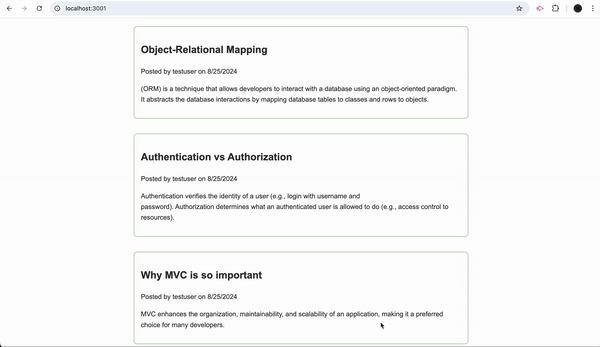

# Tech Blog

## Description

Tech Blog is a CMS-style blog site similar to a Wordpress site, where developers can publish their blog posts and comment on other developers' posts as well. This application follows the MVC paradigm in its architectural structure, using Handlebars.js as the templating language, Sequelize as the ORM, and the express-session npm package for authentication.

## Table of Contents

- [Installation](#installation)
- [Usage](#usage)
- [Features](#features)
- [Technologies Used](#technologies-used)
- [Contributing](#contributing)
- [License](#license)

## Installation

To install and run this project locally, follow these steps:

1. Clone the repository:
   ```
   git clone https://github.com/Daniel639/Tech-Blog.git
   ```
2. Navigate to the project directory:
   ```
   cd tech-blog
   ```
3. Install the required dependencies:
   ```
   npm install
   ```
4. Create a `.env` file in the root directory and add your MySQL credentials:
   ```
   DB_NAME='tech_blog_db'
   DB_USER='postgress'
   DB_PASSWORD='your_mysql_password'
   ```
5. Create the database using the MySQL shell:
   ```
   source db/schema.sql
   ```
6. Seed the database (if applicable):
   ```
   npm run seed
   ```
7. Start the server:
   ```
   npm start
   ```

## Usage

After installation, you can access the application by navigating to `http://localhost:3001` in your web browser. From there, you can:

- View existing blog posts on the homepage
- Sign up for an account or log in
- Create, update, and delete your own blog posts
- Comment on other users' blog posts

## Features

- User authentication (sign up, log in, log out)
- Create, read, update, and delete blog posts
- Comment on blog posts
- Responsive design for various screen sizes

## Technologies Used

- Node.js
- Express.js
- MySQL
- Sequelize ORM
- Handlebars.js
- express-session for authentication
- bcrypt for password hashing
- dotenv for environment variable management

## Mock-Up

The following animation demonstrates the application functionality:



## Render Link 

https://tech-blog-8r4d.onrender.com

## License

This project is licensed under the MIT License. See the [LICENSE](LICENSE) file for details.

---

For any additional questions or comments, please contact [Daniel at github.com/daniel639](https://github.com/Daniel639)
